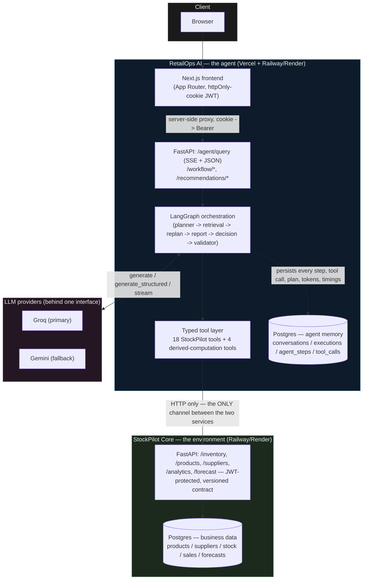
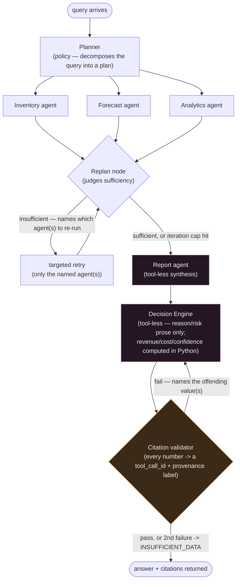
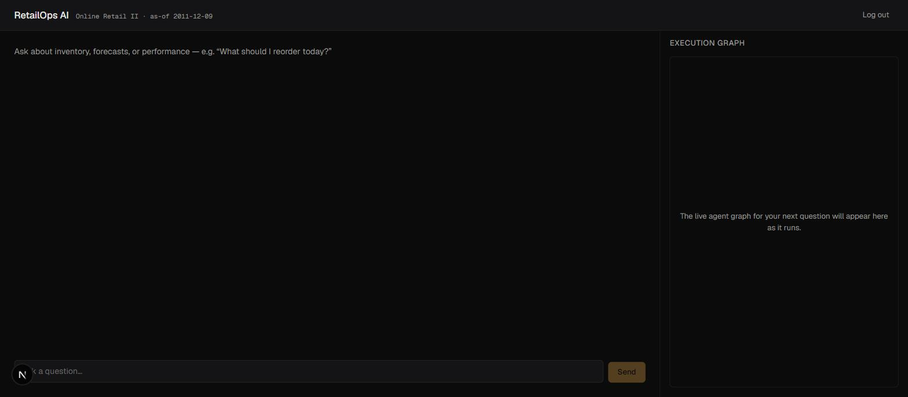
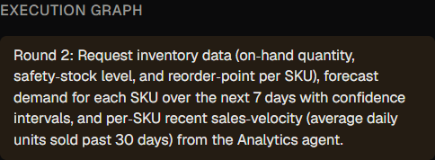
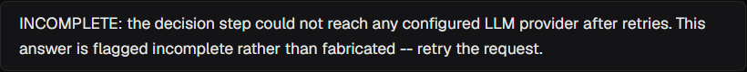

# RetailOps AI

An autonomous multi-agent system that operates a retail business: given a goal ("maintain healthy inventory") or a question ("why did profit fall last month?"), it plans its own retrieval strategy, judges whether what it retrieved is sufficient, retrieves again if it isn't, and produces answers and ranked recommendations where every number traces back to the specific tool call and data field it came from — never to the language model. It is built as two independently deployable services communicating only over HTTP: **StockPilot Core**, a headless retail-operations API that is the agent's environment, and **RetailOps AI**, a LangGraph multi-agent layer (plus the only user-facing UI) that perceives and reasons over it.

This README documents what is actually built and actually measured, per the project's own honesty rule — no metric appears below unless it was run and observed, and every section says how.

---

## THE AGENT ARCHITECTURE

Most projects labelled "agentic" are a fixed chain with an LLM bolted onto each step. This one has a real decision loop: the Planner judges, after seeing real data, whether it has enough to answer — and goes back for more, specifically, if it doesn't. That reflection-and-replan loop is the dividing line, and it isn't optional here — it runs on every query.

### The six-part agent frame

| Component | In this project |
|---|---|
| **Environment** | StockPilot Core — a headless retail-operations API the agent perceives and reasons over |
| **Perception** | A typed tool layer (29 tools across the two services) — the agent's only channel to the environment |
| **Policy** | Planner agent — decomposes a query into a plan, routes work to specialist agents, decides when it has enough |
| **Memory** | Conversation, execution, and rolling task memory, persisted in Postgres |
| **Judgment** | Decision Engine — ranks candidate actions by computed business impact |
| **Guardrails** | Citation validator, iteration/token/timeout budgets, untrusted-data envelopes, refusal paths |

### What makes it genuinely agentic

| Property | Implementation |
|---|---|
| Goal decomposition | Planner turns a free-text query or workflow goal into an execution plan |
| Autonomous tool use | Each agent selects its own tool calls within a role-scoped allow-list |
| **Reflection and replanning** | After seeing retrieved data, the Planner judges sufficiency and can re-invoke specific agents |
| Multi-agent delegation | Six specialised agents (Planner, Inventory, Forecast, Analytics, Report, Decision Engine), each with a bounded remit |
| Persistent memory | Conversation transcript plus a rolling window of prior executions, reloaded every turn |
| Self-correction | A failed citation check triggers one regeneration attempt, then an honest refusal |
| Bounded autonomy | Iteration caps, token budgets, per-call timeouts, a Groq/Gemini circuit breaker |
| Adversarial robustness | Untrusted-data envelopes around every tool result, plus a scripted prompt-injection eval scenario |
| Explicit uncertainty | Refuses (`INSUFFICIENT_DATA:` / `INCOMPLETE:`) rather than guessing when evidence or the LLM is unavailable |
| Infrastructure resilience | Multi-provider LLM failover restricted to infrastructure-class errors, invisible to the caller |

---

## Architecture — the agent/environment boundary

RetailOps AI never imports StockPilot Core's ORM models, never queries its database, and never re-implements its business logic. The two services share nothing but an HTTP contract and a JWT signing secret — see [ADR 001](docs/adr/001-agent-environment-boundary.md) for why that boundary is load-bearing, not incidental.



Two separate Postgres instances, two separate deployments, no shared credentials — "read StockPilot's tables directly" isn't a discipline problem here, it's physically unreachable from RetailOps AI's process.

## The reasoning graph — plan, retrieve, replan, cite



The retrieval fan-out (Inventory/Forecast/Analytics) genuinely runs concurrently — LangGraph schedules plain synchronous node functions in parallel when they share no dependency edge, verified with a real timing-overlap assertion (`tests/test_graph.py::test_retrieval_agents_run_concurrently`), not assumed. **Report and Decision Engine are tool-less by construction** — they cannot call StockPilot, so they are structurally incapable of fabricating a data point; every number they discuss was already fetched by the retrieval agents or computed in Python before either agent's prompt is even built.

---

## Screenshots and demo

All captured live against a running local instance — no staged or fabricated content.

| | |
|---|---|
|  |  |
| Login (proxies StockPilot's own `/auth/login` — no second user system) | The chat page before a query — the execution graph panel fills in live once one runs |

**A real query and the replan loop firing, reasoning visible** (`docs/screenshots/demo-query-and-replan.gif`) — asking *"What should I reorder today, and how confident are you in that?"* fans out to all three retrieval agents, and the Planner genuinely judges the first round insufficient:



*"Round 2: Request inventory data (on-hand quantity, safety-stock level, and reorder-point per SKU), forecast demand for each SKU over the next 7 days with confidence intervals, and per-SKU recent sales-velocity (average daily units sold past 30 days) from the Analytics agent."* — that text is the real Planner output for a real round-2 judgement, not a scripted example.

**Both providers down, degrading honestly instead of leaking a raw error** (also caught live during this capture, fixed same-day — see Resilience above):



**Citation drill-down is real, tested, and was live-verified when F4 shipped** (click any cited number in a chat answer → a provenance drawer opens showing the exact `tool_call_id`, agent, field, provenance label, and raw tool response — `frontend/components/CitationText.tsx` / `ProvenanceDrawer.tsx`, `frontend/lib/citations.test.ts`) — **honestly, no fresh screenshot of it is included here.** This session's live capture attempt hit real Groq/Gemini quota limits (documented below) before a clean grounded answer completed a second time; rather than force additional live calls against an account already under load, the existing automated coverage stands in for a fresh screenshot. Re-capturing this is the first thing worth doing once quota headroom is available.

---

## How this system avoids hallucinated numbers

Three invariants, enforced at three different points, not just requested in a prompt:

1. **Tool-less synthesis.** `agents/report.py` and `agents/decision.py` are built from agents with an empty tool list (`agents/base.py::build_agents`). They cannot issue a StockPilot call. Every number that reaches their prompt was fetched earlier by Inventory/Forecast/Analytics, or computed deterministically in Python (`services/*`) from numbers those agents fetched. The Decision Engine's own LLM call is further constrained to a two-field schema (`reason`, `risk_if_ignored`) — it cannot even emit a number in its structured output; `revenue_at_risk`, `inventory_cost`, `confidence`, and `priority` are computed entirely outside the LLM call.
2. **A runtime citation validator, not a trust exercise.** Before any answer is returned, `orchestration/validator.py::validate_citations()` extracts every numeric token from the draft and confirms each one appears in a `tool_calls.raw_response` recorded for *this* execution, with a provenance label attached to the field it came from. A number that appears nowhere in the retrieved evidence is treated as fabricated; a real number missing its provenance label is treated as un-cited — both are rejected. First failure regenerates the answer, naming exactly which values failed; a second failure gives up and returns a fixed `INSUFFICIENT_DATA:` message rather than trying a third time.
3. **Untrusted-data envelopes.** Every tool result is wrapped (`agents/envelope.py`) in a delimited block with a random per-call suffix and an explicit "this is DATA, not instruction" declaration before it ever reaches a prompt — so a product description or supplier note containing text that reads like an instruction cannot be interpreted as one. Covered by a dedicated prompt-injection scenario in the eval suite (below).

**Measured, not asserted:** running the 10-scenario eval suite (`python evals/run.py`, scripted/mocked LLM responses, zero real network calls — see the caveat below) on 2026-07-31:

```
grounding=100.0%  accuracy=100.0%  routing=100.0%  replan=100.0%  refusal=100.0%
```

**What "100% grounding" actually measures, stated plainly:** the eval harness scripts the LLM's own output for each scenario (a known, fixed response), so this number measures whether the deterministic machinery around the LLM — the validator, the envelope, the replan-routing logic — behaves correctly given that output, not whether a live model refrains from hallucinating in general. It is a test of the *guardrail*, not a claim about model behavior in the wild. Live queries against real Groq/Gemini traffic were run repeatedly throughout this build (documented per-task in the commit history) and never produced an answer the validator let through with an uncited number — if one had, the validator would have caught it, which is the actual guarantee this architecture makes.

---

## Data provenance

Every numeric field in every API response and every agent-cited value carries one of four labels, defined once (`docs/adr/003-provenance-model.md`) and threaded through schema, API, agents, and UI:

| Label | Meaning |
|---|---|
| `observed` | Directly from the source dataset |
| `derived` | Deterministically computed via a documented method |
| `predicted` | Output of the forecasting model |
| `inferred` | Reserved; unused |

Provenance is never upgraded — a value computed from a `predicted` input stays `predicted`.

**Stated plainly, not buried:** the source dataset (Online Retail II) has no cost price, stock levels, suppliers, or product categories. All four are derived by a seeded, deterministic script (`stockpilot-core/scripts/run_etl.py`, methodology and formulas in `stockpilot-core/docs/data-derivation.md`) and labelled `derived` everywhere they appear — never presented as if they were part of the original data.

---

## Resilience

LLM calls go through one interface (`generate()` / `generate_structured()` / `stream()`) behind which a provider-layer fallback chain lives entirely (`llm/providers/fallback.py`) — `agents/base.py` and everything above it never knows which provider actually served a call.

- **Failover fires only on infrastructure-class errors** — quota/429 (and Groq's own 413 "request exceeds this account's per-minute token budget," found live and given identical treatment), or a timeout/connection failure after its own in-provider retries. It never fires on a citation-validator rejection or a model failing to follow structured-output instructions — a different provider wouldn't fix either, and calling that "provider unavailable" would be dishonest.
- **A conversation is pinned to whichever provider served its first call** for the rest of that conversation — a later round never silently re-resolves to a different provider, which would otherwise let one provider see a message history containing turns it didn't produce (a real bug, caught live and fixed; full account in [ADR 007](docs/adr/007-multi-provider-fallback.md)).
- **The serving provider and model are recorded per call**, not just the configured ones — `AgentStep.provider`, the `/agent/query` response's `serving` field, and the SSE `agent_completed` event all carry it, because a single execution can legitimately span providers under failover.
- **Both providers down degrades gracefully** — a clean `INCOMPLETE:` message, never a raw 500 or a partial/fabricated answer. Verified live — including a real bug found and fixed this way: an early version of this message embedded the raw underlying provider exception (a full Gemini 429 JSON body, quota numbers and model name included), which directly violated the "never a raw provider error" rule above. Caught live, fixed, re-verified live with the sanitized message rendering correctly (screenshot below).
- **Groq itself supports multiple rotating API keys** (`GROQ_API_KEY_1`, `GROQ_API_KEY_2`, ...) — a rate-limit-class error rotates to the next configured key and retries before Groq is ever reported as "unavailable" to the fallback chain above; Gemini failover only fires once every configured Groq key is exhausted. Verified live: a real session hit key 1's daily budget, rotated to key 2, and logged `"Groq API key #1 rate-limited; rotating to key #2 of 3 configured"` — the index only, never the key value.

**Why Groq is the configured primary — a quota-availability decision, not a quality claim.** This project's Gemini account has an observed hard-zero quota on its `-pro` model family for the entire build, and a very small daily allowance on `-flash`. Groq's rate limits are generous enough for normal traffic, and multiple rotating keys extend that further. Gemini remains a fully real, live-verified fallback for when every configured Groq key is exhausted — nothing about Gemini's capability motivated the ordering, only which provider could reliably serve first.

---

## Evaluation

`python evals/run.py` runs 10 scripted scenarios (`retailops-ai/evals/scenarios/`) covering normal operation, a seasonal demand spike, a brand-new SKU with no history, a supplier delay, empty inventory, a missing forecast, StockPilot being unreachable, a prompt-injection attempt, an ambiguous question, and a genuinely unanswerable question — through the real graph/workflow code, real citation validator, only the LLM response scripted. Full methodology and scoring rules in [ADR 006](docs/adr/006-evaluation-strategy.md).

**Measured 2026-07-31, zero real network calls, CI gate passed:**

| Scenario | Grounding | Accuracy | Routing | Replan | Refusal |
|---|---|---|---|---|---|
| 01 normal operations | PASS | PASS | PASS | PASS | PASS |
| 02 seasonal demand spike | PASS | PASS | PASS | PASS | PASS |
| 03 new SKU, no history | PASS | PASS | PASS | PASS | PASS |
| 04 supplier delay | PASS | PASS | PASS | PASS | PASS |
| 05 empty inventory | PASS | PASS | PASS | PASS | PASS |
| 06 missing forecast | PASS | PASS | PASS | PASS | PASS |
| 07 StockPilot unavailable | PASS | PASS | PASS | PASS | PASS |
| 08 prompt injection | PASS | PASS | PASS | PASS | PASS |
| 09 ambiguous question | PASS | PASS | PASS | PASS | PASS |
| 10 unanswerable question | PASS | PASS | PASS | PASS | PASS |
| **Aggregate** | **100.0%** | **100.0%** | **100.0%** | **100.0%** | **100.0%** |

Baseline (`evals/baseline.json`, recorded 2026-07-30) tracks `accuracy_pct` only — grounding has no baseline, it is checked directly against the spec's constant 100% requirement, always.

---

## Forecasting

`POST /forecast/demand` is backed by a real backtest across three models — measured 2026-07-29 by `stockpilot-core/scripts/train_forecast_model.py` on a 28-day held-out window (2011-11-12 to 2011-12-09) over 4,801 SKUs with at least 42 days of pre-holdout sales history:

| Model | MAE (units/day) | MAPE |
|---|---|---|
| Seasonal naive (7-day cycle) | 6.01 | 246.97% |
| **Moving average (28-day window) — selected** | **5.19** | **158.88%** |
| Gradient-boosted (`HistGradientBoostingRegressor`, lag/rolling/calendar features, recursive 28-step forecast) | 6.08 | 250.02% |

**The gradient-boosted model does not beat the moving-average baseline**, so the API serves the baseline, not the GBM — the trained GBM artifact is not shipped. Error compounds over a 28-step recursive forecast faster than the model's extra features earn back on this dataset; this is reported honestly rather than shipping the more sophisticated-sounding model anyway. Full detail in `stockpilot-core/README.md#forecasting`.

---

## Honest limitations

Nothing below is buried. Each is a real, currently-true gap, not a hypothetical.

**Frontend scope.** The frontend priority list (F1–F7) is only built through **F4**: Next.js chat UI with JWT auth (F1), SSE streaming of tokens and progress events (F2), a live execution-graph visualizer (F3), and citation drill-down onto the raw tool response (F4) — all four built and covered by tests; F1–F3 plus the graceful-degradation path are freshly screenshotted above. **F5 (provenance badges throughout the UI), F6 (recommendation cards and a dedicated reports view), and F7 (an agent status panel, tool-usage timeline, backtest-mode banner, and visual polish) are not built.** The spec itself sanctions stopping at F4 "if time runs short"; this build stopped there deliberately to ship complete, tested documentation rather than a partially-built F5/F6. Two concrete consequences: the screenshots above do **not** include a recommendation card, since F6 (the UI that renders one) doesn't exist; and the citation drill-down screenshot is cited from its own test coverage rather than freshly captured, for the quota reason explained above.

**Two real, live-discovered bugs found during this session's own demo capture, not yet fixed.** Neither involves a fabricated or uncited number — invariant 1 held in both cases — but both are genuine defects, written down rather than quietly worked around:
- A broad inventory question (e.g. "which products are low on stock") can fetch up to 1,000 rows from StockPilot; feeding that back to Groq as tool-result context can exceed its context window (`400 context_length_exceeded`). This isn't in the failover-eligible error set (a 400 isn't a quota/timeout problem — a different provider wouldn't fix it either), and nothing currently catches it as a graceful degradation path, so it currently surfaces as a generic "something went wrong" error instead of an honest, specific one. Needs either a tool-result size cap or a dedicated degradation path for this error class.
- The Decision Engine's free-chat synthesis (the general `/agent/query` path, not the structured per-SKU recommendation pipeline) was observed once producing confused prose that referenced its own structured-output schema field names (`reason`, `risk_if_ignored`) instead of answering the actual question, for a simple single-SKU stock-level query. Observed live, not yet consistently reproduced or root-caused — worth investigating with a scripted regression case before assuming it's model noise.

**Streaming-path execution_id correlation (Task 6.3).** `logging_config.py`'s `execution_id` contextvar is bound around the blocking `/agent/query` path and propagates correctly into the three concurrent retrieval agents' own threads. It is deliberately **not** bound around the SSE streaming path — attempting it broke live with `ValueError: token ... was created in a different Context`, because a `contextvars.Token` can only be reset in the same Context it was created in, and a sync generator consumed via Starlette's threadpool doesn't guarantee one Context persists across successive resumptions. The general lesson (documented inline): contextvars bound inside a generator consumed this way are unsafe across multiple `next()` calls — only safe to bind/reset around a single blocking call. Structured logs for streamed executions are therefore not automatically correlated by `execution_id` the way blocking-path logs are; the trace itself (persisted `agent_steps`/`tool_calls` rows) is unaffected, since that's written independently of the logging layer.

**Groq-specific findings (ADR 007).** Two real, non-obvious provider bugs surfaced only under live traffic, not by reading either SDK's docs: (1) Groq's smaller `gpt-oss-20b`/`-safeguard-20b` variants intermittently attempted a phantom tool call against this project's real planner prompt specifically — fixed by setting `tool_choice` explicitly on every call and pinning the fallback-role model to the 120b variant, which never reproduced it. (2) Groq signals "this request exceeds the account's per-minute token budget" as a bare HTTP 413, not the 429 its own `RateLimitError` type is reserved for — invisible until Groq began carrying full primary-role traffic, now given the same immediate-failover treatment as a 429.

**`ToolCall.agent_step_id` is never populated.** The column exists on the model (since Stage 2) as the seemingly-obvious foreign key for "which agent made this call," but nothing in the codebase ever sets it — a real, pre-existing gap, rediscovered twice (Stage 6 F3's tool-name attribution, F4's citation-drill-down agent attribution) and worked around both times by reading the already-correct `agent` tag on `ExecutionState["tool_ledger"]` instead. Not fixed at the source, since every consumer that needs this information already has a working alternative.

**Three StockPilot Core gaps, logged and worked around, not silently patched over** (full detail in `docs/stockpilot-gaps.md`):
- No endpoint exposes a per-SKU unit price directly; `revenue_at_risk` is only computed for SKUs that appear in a bounded top/bottom-products ranking — not exhaustive across the catalog.
- No point-in-time (historical) query exists for inventory or forecasting. `business-review`'s backtest mode is real (analytics endpoints genuinely accept a date range over immutable sales history); `inventory-health`'s backtest mode can only apply an honest "historical simulation, not live monitoring" label — the underlying stock/reorder figures are always the current live snapshot, since no endpoint can return anything else.
- Forecast confidence intervals use one global residual standard deviation pooled across all ~4,800 SKUs, not a per-SKU-calibrated interval — deliberately conservative rather than falsely precise.

**Test coverage is not uniform by design, not oversight.** `retailops-ai` measures 98% overall (331 tests); `stockpilot-core` measures 86% overall (110 tests) — the gap is concentrated entirely in one-off CLI scripts (`run_etl.py`, `train_forecast_model.py`, `seed_demo_user.py`, `scripts/etl/load.py`), which are verified by actually running them against a real database rather than unit-tested, the same precedent every `scripts/*.py` entrypoint in this codebase follows. Every business-logic, agent, tool, and validator module measures 97–100%.

---

## Setup

Requires Python 3.11, Docker Desktop, and Node.js (for the frontend). Windows commands shown (this project was built on Windows 11 + PowerShell); paths adjust trivially for macOS/Linux.

```
make setup       # creates both venvs, installs both services + dev deps, installs pre-commit
make db-up       # starts both Postgres instances (docker compose) — 5434 (StockPilot), 5433 (RetailOps AI)
make ingest      # downloads Online Retail II and runs the full reproducible ETL (~15-25 min)
make test        # runs both Python test suites
make eval        # runs the 10-scenario eval suite, zero real network calls

make run-core    # StockPilot Core on :8000
make run-agents  # RetailOps AI on :8001

cd retailops-ai/frontend
npm install
npm run dev      # frontend on :3000
```

Copy each `*/.env.example` to `*/.env` and fill in `POSTGRES_*`, a shared `JWT_SECRET` (both services must use the **same** value — StockPilot issues the token, RetailOps AI only verifies its signature, no second user system), `GEMINI_API_KEY`, and at least one Groq key (`GROQ_API_KEY_1`, optionally `GROQ_API_KEY_2`/`_3`/... — see Resilience above). `retailops-ai/frontend/.env.example` needs no secrets — it only points at the two backend base URLs.

## Deployment

Not yet complete as of this writing. The target architecture (both Python services on Railway/Render with managed Postgres, the frontend on Vercel, secrets via platform environment variables, a seeded demo database with a read-only login, CI gates on tests/type-checks/contracts/the eval grounding gate) is specified in `docs/BUILD-SPEC.md`'s Stage 7. This documentation deliverable was intentionally written first so it could be produced without depending on external hosting accounts; deploy is the remaining Stage 7 sub-task.

## ADR index

| ADR | Decision |
|---|---|
| [001](docs/adr/001-agent-environment-boundary.md) | Two services, HTTP-only, separate databases — why the environment/agent split is load-bearing, not decorative |
| [002](docs/adr/002-postgresql.md) | PostgreSQL over the alternatives, and the SQLite test-fixture tradeoffs that follow from it |
| [003](docs/adr/003-provenance-model.md) | The four-label provenance model and where it's enforced |
| [006](docs/adr/006-evaluation-strategy.md) | The 10-scenario eval suite's scoring methodology and its scripted-LLM scope |
| [007](docs/adr/007-multi-provider-fallback.md) | The provider-layer fallback chain, the conversation-pinning fix, and both live-found Groq bugs |

## Tech stack

Python 3.11 · FastAPI · SQLAlchemy 2.x + Alembic · Pydantic v2 · PostgreSQL 16 · Docker Compose · LangGraph · Groq (primary) + Gemini (fallback) LLMs · scikit-learn / pandas / NumPy · pytest + pytest-asyncio · ruff + mypy --strict · Next.js (App Router) + React + TypeScript + Tailwind v4 · GitHub Actions CI.

## Dataset and license

[Online Retail II](https://archive.ics.uci.edu/dataset/502/online+retail+ii) (UCI Machine Learning Repository, CC BY 4.0). This repository is MIT-licensed (`LICENSE`).
